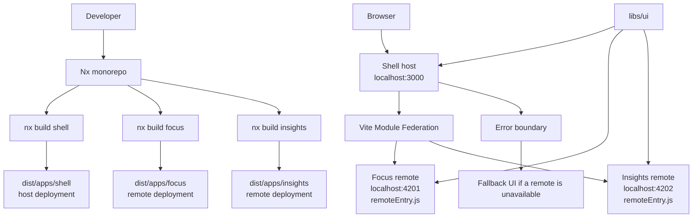

# Pulse Command - Nx Microfrontend Boilerplate

> I built this as a practical React microfrontend boilerplate using Nx, Vite, Module Federation, TypeScript, and separately buildable host/remote apps.

[](https://nx.dev)
[](https://react.dev)
[](https://vitejs.dev/)
[](https://module-federation.io/)

## What I Built

I wanted this project to show microfrontend architecture clearly, not just look like another dashboard template.

The app is an interactive walkthrough. When you click through the sections, it explains how the Nx workspace is organized, how Module Federation loads the remotes, and how each app can be built separately.

The repo has four main pieces:

- `shell`: the host app that owns layout, navigation, composition, and fallback handling
- `focus`: a remote app that represents one independently deployable feature area
- `insights`: another remote app that is loaded by the shell at runtime
- `ui`: a small shared library for common copy/types used across the apps

## Architecture



## Project Structure

```txt
apps/
├── shell/                 # Host app: layout, composition, remote loading
├── focus/                 # Remote MFE: focus-related workflows
└── insights/              # Remote MFE: analytics and recommendations

libs/
└── ui/                    # Shared copy/types used across MFEs

nx.json                    # Nx cache and target defaults
tsconfig.base.json         # Shared TypeScript config
vercel.json                # Host deployment config
```

## How Module Federation Works Here

The shell has remote URLs in its Vite federation config:

```ts
remotes: {
  focus: 'http://localhost:4201/assets/remoteEntry.js',
  insights: 'http://localhost:4202/assets/remoteEntry.js',
}
```

Each remote exposes a module:

```ts
exposes: {
  './Module': './src/RemoteApp.tsx',
}
```

Then the shell imports those modules:

```ts
const FocusRemote = lazy(() => import('focus/Module'));
const InsightsRemote = lazy(() => import('insights/Module'));
```

That is the main point of the demo: the shell is not just showing static cards. It is loading remote apps through Module Federation.

## Running Locally

Install dependencies:

```bash
npm install
```

Run the shell and remotes:

```bash
npm run dev
```

Open:

```txt
http://localhost:3000
```

Ports used:

```txt
shell:    http://localhost:3000
focus:    http://localhost:4201
insights: http://localhost:4202
```

The shell runs with the Vite dev server. The remotes are built and served as static federated artifacts so their `remoteEntry.js` files behave like CDN-hosted remotes.

## Build Commands

Build everything:

```bash
npm run build
```

Build one app:

```bash
npm run build:shell
npm run build:focus
npm run build:insights
```

Build only affected projects:

```bash
npm run affected:build
```

## Deployment Idea

The output folders are separate:

```txt
dist/apps/shell
dist/apps/focus
dist/apps/insights
```

In a real deployment, I would deploy the shell to Vercel or another static host, and deploy each remote to its own CDN/static hosting path. The shell would then point to the deployed `remoteEntry.js` URLs.

Demo: https://react-microfrontend-shell.vercel.app/

## Vercel

The current `vercel.json` is set up for deploying the shell:

```json
{
  "outputDirectory": "dist/apps/shell",
  "buildCommand": "npm run build",
  "installCommand": "npm install"
}
```

For a portfolio demo, deploying the shell is enough to show the UI and structure. For a complete production-style demo, I would also deploy `focus` and `insights` separately and update the shell remote URLs.

## What I Want This Project To Show

- I understand Nx monorepo structure.
- I can separate host and remote apps cleanly.
- I can wire Module Federation instead of only describing it.
- I can build each microfrontend separately.
- I can explain the architecture through the UI itself.
- I can keep the design simple, light, and enterprise-friendly.
