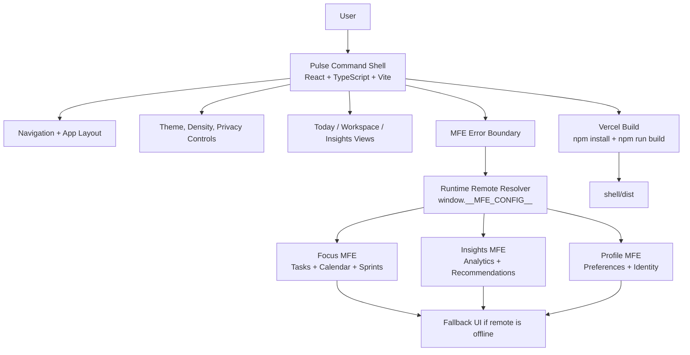

# Pulse Command - React Microfrontend Shell

> A premium Personal Command Center built with React, TypeScript, and Vite. The app presents a polished shell experience with remote-ready microfrontend surfaces, command-first navigation, personalization controls, and resilient fallback states.

[](https://www.typescriptlang.org/)
[](https://react.dev)
[](https://vitejs.dev/)

## Why This Project Stands Out

Most microfrontend demos feel like architecture diagrams with placeholder cards. Pulse Command is designed to feel like a real product: a personal operating surface where each future remote app can own a focused part of the user experience.

The current shell includes:

- Premium dashboard UI inspired by modern fintech and productivity products
- Command palette with keyboard shortcut support
- Personalization rail with theme, density, and privacy controls
- Remote-ready workspace for Focus, Insights, and Profile micro apps
- Error boundary and fallback pattern for unavailable remote surfaces
- Responsive layout for desktop and smaller screens
- Clean React structure with separated components, views, data, types, and styles

## Live Experience

The demo opens directly into the usable app, not a marketing page:

- `Today`: high-signal personal dashboard
- `Workspace`: micro app registry and remote fallback surface
- `Insights`: behavior intelligence and suggested automations

## What This App Is About

Pulse Command is a **Personal Command Center** demo. The product idea is simple: give a user one premium control surface for their day, while letting different business capabilities evolve as independent micro apps.

In a real company, separate teams could own these surfaces:

- `Shell`: navigation, layout, themes, personalization, resilience, and app composition
- `Focus MFE`: tasks, calendar protection, deep work sessions, rituals
- `Insights MFE`: behavior analytics, productivity patterns, recommendations
- `Profile MFE`: preferences, permissions, saved layouts, identity

This repo currently implements the shell and polished placeholder surfaces. The placeholder exists to show where a real remote microfrontend would be loaded later.

## Architecture



### Runtime Remote Config

`window.__MFE_CONFIG__` is a common microfrontend pattern. It is a runtime object that tells the shell where each independently deployed remote app lives.

Example:

```ts
window.__MFE_CONFIG__ = {
  focusRemote: 'https://cdn.example.com/focus/remoteEntry.js',
  insightsRemote: 'https://cdn.example.com/insights/remoteEntry.js',
  profileRemote: 'https://cdn.example.com/profile/remoteEntry.js',
};
```

Why this matters: the shell can stay deployed while a remote team ships a new version of `Insights MFE` to its own CDN URL. The shell reads the config at runtime and loads the latest remote without needing a full shell rebuild.

In this portfolio version, the real remotes are not wired yet. The Workspace view shows the intended remote slots and a fallback UI so reviewers can understand the architecture direction.

```txt
shell/
├── index.html
├── src/
│   ├── App.tsx                  # Application orchestrator
│   ├── main.tsx                 # Vite entry
│   ├── components/              # Reusable UI and MFE resilience components
│   ├── views/                   # Route-level product surfaces
│   ├── data/                    # Mock product data and theme tokens
│   ├── styles/                  # Command Center CSS
│   └── types.ts                 # Shared domain types
├── package.json
├── tsconfig.json
└── vite.config.ts
```

The shell is intentionally structured so real remotes can be added behind the existing workspace cards. Until those remotes are wired in, the fallback surface demonstrates how the shell keeps the product usable when a microfrontend is unavailable.

## Getting Started

```bash
npm install
npm run dev
```

Open:

```txt
http://localhost:3000
```

## Scripts

```bash
npm run dev       # Start the Vite dev server
npm run build     # Type-check and build for production
npm run preview   # Preview the production build locally
```

## Deployment

This repo is ready for Vercel. The root `vercel.json` builds the `shell` workspace and serves `shell/dist`.

Recommended Vercel settings:

- Framework Preset: `Vite`
- Build Command: `npm run build`
- Output Directory: `shell/dist`
- Install Command: `npm install`

## Recruiter / Reviewer Notes

This project is meant to show more than basic React rendering. It demonstrates:

- Component decomposition and UI ownership boundaries
- Typed React props and shared domain types
- Product-thinking in a technical demo
- Resilient shell patterns for microfrontend-style apps
- Responsive CSS architecture without depending on a heavy UI kit

## Next Improvements

- Add real remote apps using Vite Module Federation
- Persist personalization settings in local storage
- Add route URLs for `Today`, `Workspace`, and `Insights`
- Add unit tests for component behavior
- Add Playwright smoke tests for the command palette and navigation

## Author

**Pradeep Kumar Dharmavarapu**  
[LinkedIn](https://linkedin.com/in/pradeep-kumar-dharmavarapu) · [GitHub](https://github.com/pradeep-kumar-dharmavarapu)
